# Digital Signal Processing with Python

A practical project covering Digital Signal Processing, Machine Learning,
Deep Learning, and AI-based signal analysis using Python.

---

## Signal Processing Results

### 01 — Basic Signals

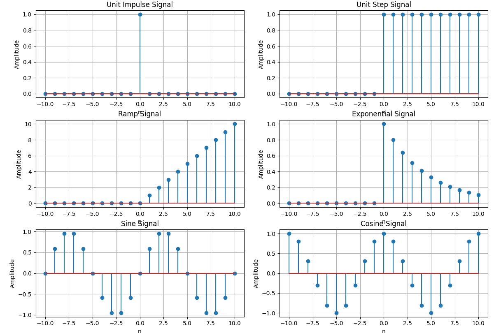

### 02 — Signal Operations

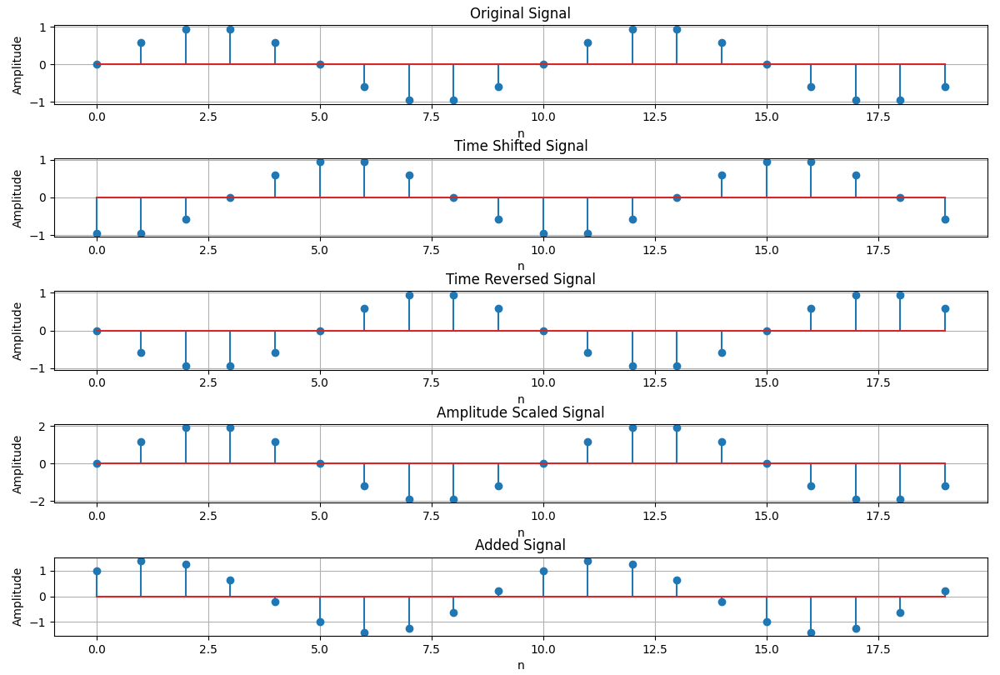

### 03 — Convolution

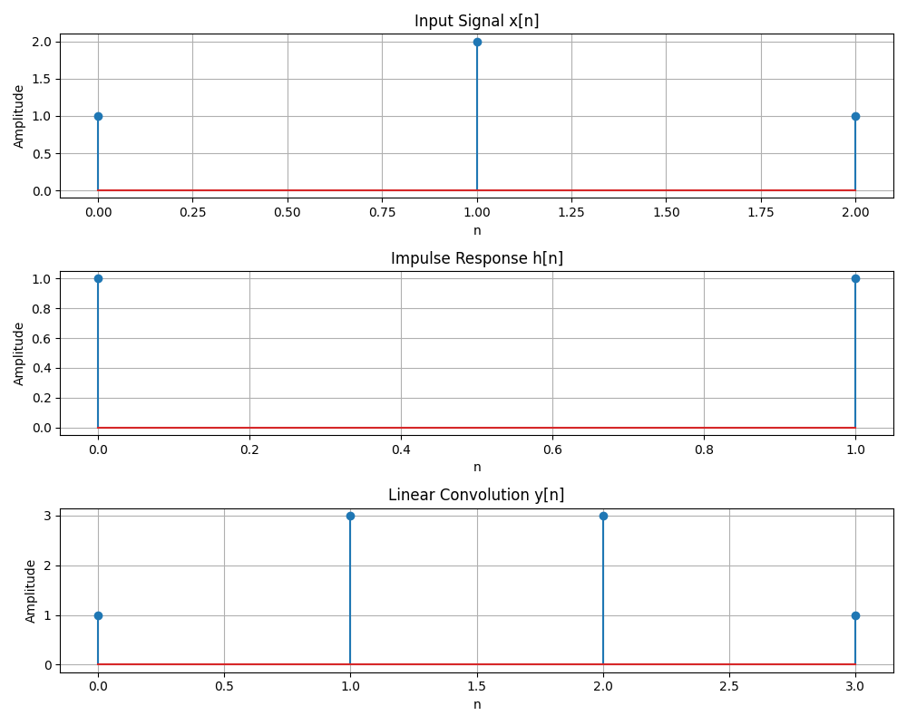

### 04 — Correlation

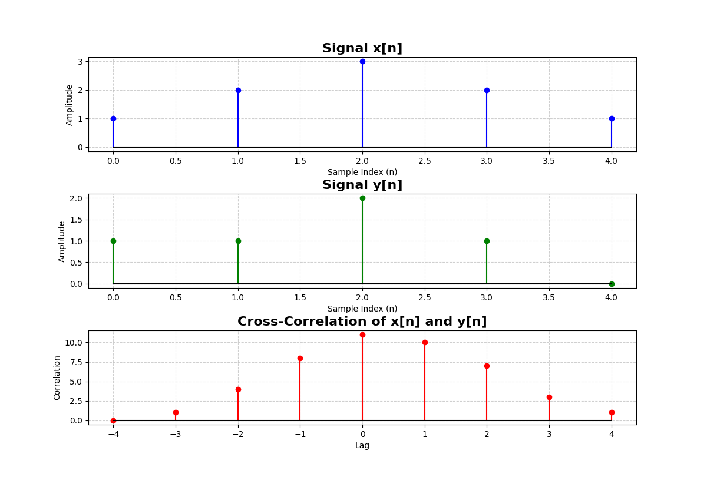

### 05 — Sampling

### 06 — FFT Analysis

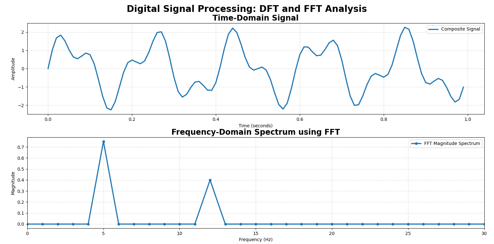

### 07 — Digital Filtering

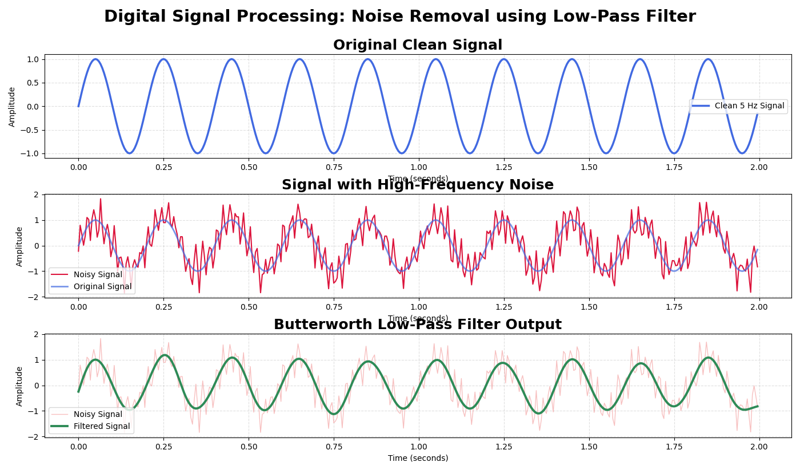

---

## Machine Learning Results

### 09 — Feature Distribution

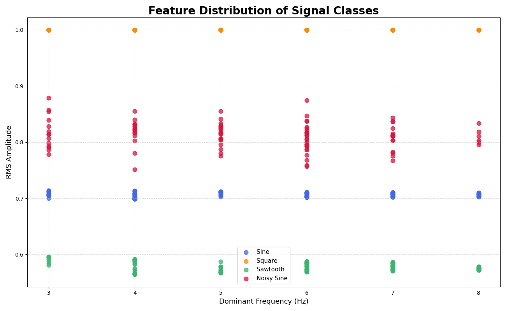

### 10 — Data Preprocessing

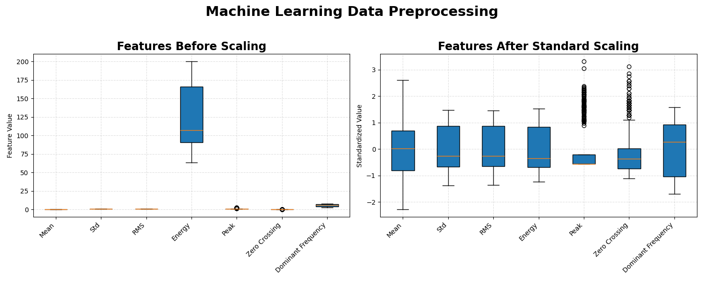

### 11 — ML Classification

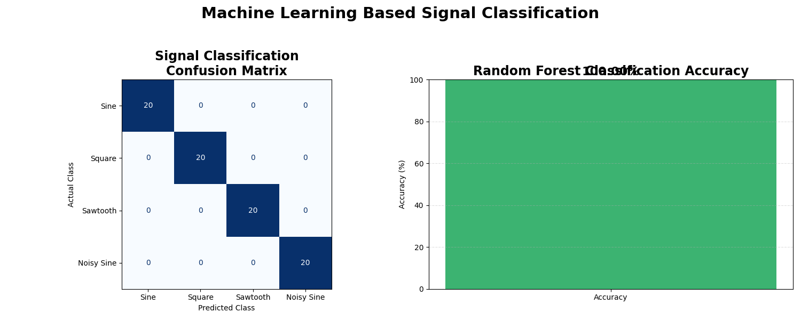

### 12 — Model Evaluation

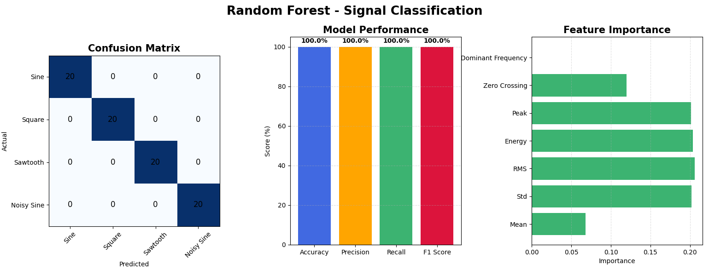

---

## Deep Learning Results

### 13 — Spectrogram Analysis

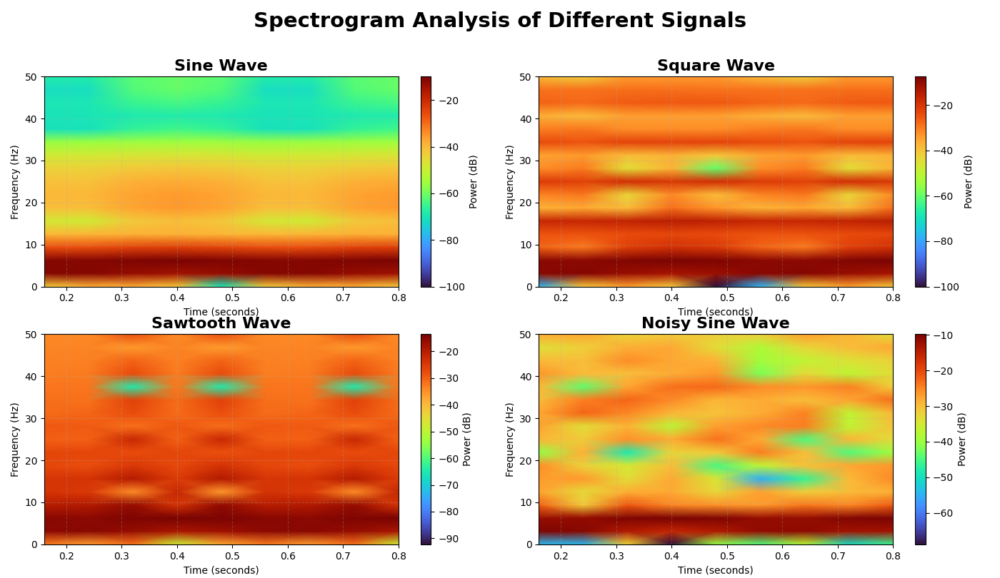

### 14 — CNN Classification

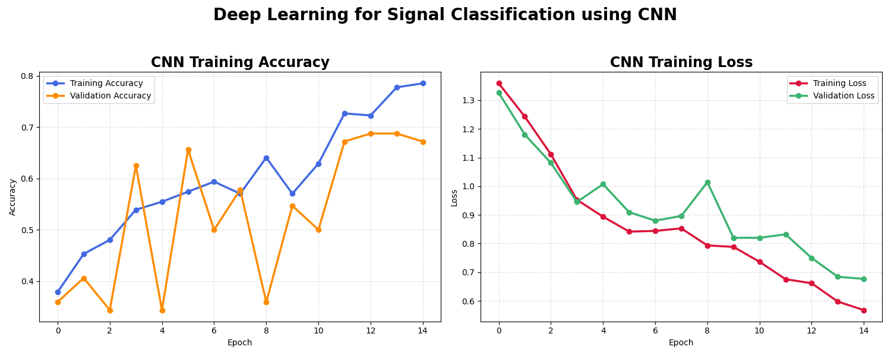

### 15 — CNN Evaluation

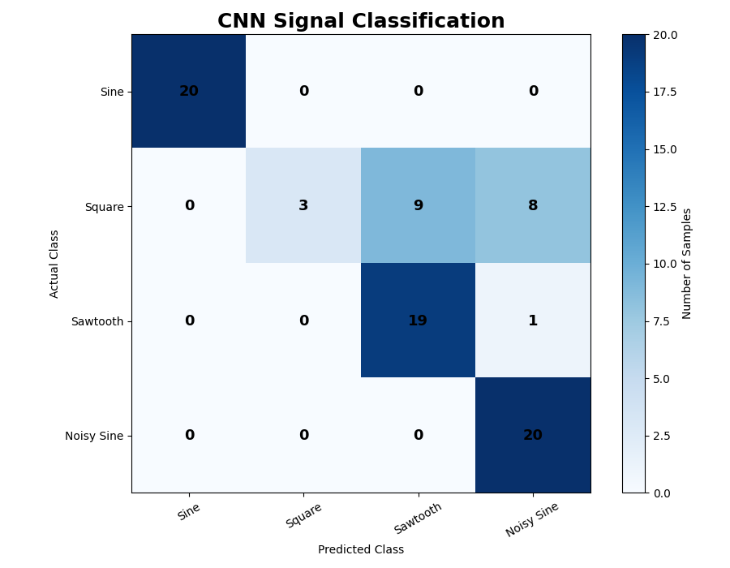

### 16 — ML vs DL

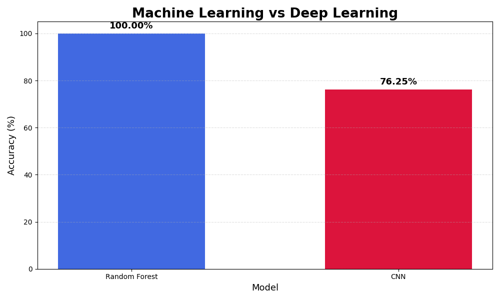

---

## AI Applications

### 18 — Noise Reduction

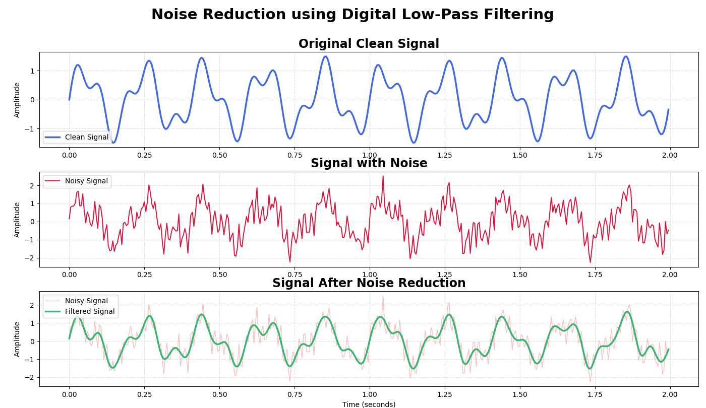

### 19 — AI Signal Analysis

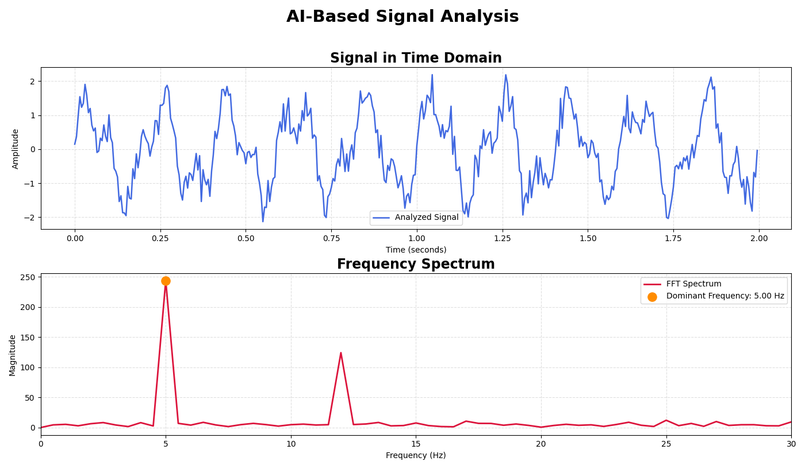

---

## Technologies

Python • NumPy • SciPy • Matplotlib • Scikit-learn • TensorFlow • Keras
